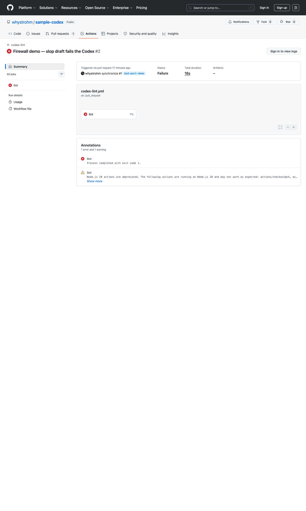

# Sample Founder Codex — Linear

A working public Codex for [linear.app](https://linear.app/), built as a reference implementation for the format. Real rules, real linter, real CI. The Action on this repo blocks any PR that violates the Codex.

The bad-PR demonstration lives at [`PR #1`](https://github.com/whystrohm/sample-codex/pull/1) — an intentionally-slop draft that fails CI. Click through to see the workflow log catch the violations in plain text.

> If you want a Codex like this generated for your own brand, the engine that produces it lives at [whystrohm.com](https://whystrohm.com).

---

## What is a Founder Codex?

A Codex is the language constants of a brand, captured as code instead of a PDF. Four files plus an example library, all rendered into formats a machine reads on every output.

The problem the format solves: every founder-led brand has a style guide. Almost none of them get used. The guide is a PDF in Notion. The contractor opens ChatGPT and writes whatever ChatGPT writes. The output ships. The brand sounds like every other AI-written SaaS company.

The Codex flips that. The same rules live as `brand.config.ts` (the voice constants), `codex.rules.json` (the structural rules), `forbidden.json` (the blocklist), and `CLAUDE.md` (the operating instructions for any AI writing assistant pointed at the repo). A CI job runs the rules against every PR. Nothing on-brand slips through and nothing off-brand merges.

A real engagement to build one of these for a brand takes about 30 days. This repo is the artifact a buyer gets at the end — same shape, populated with their language instead of Linear's.

## What's in this repo

```
sample-codex/
├─ README.md                    ← you're here
├─ brand.config.ts              ← voice constants: paragraph, 7 axes,
│                                  register, approved patterns
├─ codex.rules.json             ← 6 structural rules (block + warn)
├─ forbidden.json               ← blocklist: 50+ words and phrases,
│                                  categorized
├─ CLAUDE.md                    ← operating instructions for Claude Code
│                                  / any AI writing assistant
├─ codex-lint.mjs               ← the linter the CI Action runs.
│                                  Zero dependencies, runs on Node 20+
├─ CODEOWNERS                   ← every PR routes to @whystrohm
├─ examples/
│  ├─ good-post.md              ← Linear-flavored draft that PASSES
│  └─ bad-post.md               ← deliberately slop draft that FAILS
└─ .github/workflows/
   └─ codex-lint.yml            ← runs the linter on every PR
```

Everything is human-readable. Click any file in the GitHub UI.

## How does the firewall use it?

The Action in [`.github/workflows/codex-lint.yml`](.github/workflows/codex-lint.yml) runs on every pull request. It checks out the branch, finds changed markdown files, and runs:

```
node codex-lint.mjs <changed-files>
```

The linter reads `codex.rules.json` and `forbidden.json` and applies them to each file. Output looks like this in the CI log:

```
examples/bad-post.md
  ✗ no-em-dashes               em-dash on line 3 col 47
  ✗ no-forbidden-words         "game-changing" (globally_banned_words) on line 1 col 14
  ✗ no-forbidden-words         "thrilled" (enthusiasm_verbs) on line 3 col 4
  ...
  ⚠ max-sentence-length        38% of sentences over 25 words (limit 30%)

1 file checked, 7 block violations, 1 warning. FAILED.
```

Block rules (no em-dashes, no forbidden words) fail CI with exit code 1. Warn rules surface in the log but the build passes. The two block categories are non-negotiable — they're the patterns that mark text as AI slop.

## See it work

There's a permanent open pull request on this repo that demonstrates the firewall catching a slop draft:

**[`PR #1 — Firewall demo, slop draft fails the Codex`](https://github.com/whystrohm/sample-codex/pull/1)**

The PR adds `examples/bad-post.md` with deliberate violations. The Action runs and fails. The PR is not mergeable. It stays open forever as the demonstration.



What the CI log shows (excerpted):

```
examples/bad-post.md
  ✗ no-em-dashes                 em-dash on line 1 col 27
  ✗ no-em-dashes                 em-dash on line 3 col 69
  ✗ no-em-dashes                 em-dash on line 5 col 131
  ✗ no-em-dashes                 em-dash on line 20 col 171
  ✗ no-forbidden-words           "game-changing" (globally_banned_words) on line 1 col 31
  ✗ no-forbidden-words           "transformative" (globally_banned_words) on line 3 col 73
  ✗ no-forbidden-words           "cutting-edge" (globally_banned_words) on line 3 col 89
  ✗ no-forbidden-words           "Artificial intelligence is fundamentally reshaping" (ai_era_clutter) on line 5 col 1
  ✗ no-forbidden-words           "purpose-built system" (abstract_noun_clusters) on line 5 col 135
  ✗ no-forbidden-words           "shared, structured environment" (abstract_noun_clusters) on line 5 col 201
  ✗ no-forbidden-words           "revolutionary" (globally_banned_words) on line 7 col 28
  ✗ no-forbidden-words           "innovative" (globally_banned_words) on line 9 col 20
  ✗ no-forbidden-words           "robust" (globally_banned_words) on line 9 col 32
  ✗ no-forbidden-words           "seamless" (globally_banned_words) on line 9 col 44
  ✗ no-forbidden-words           "harness the power of" (ai_era_clutter) on line 9 col 89
  ✗ no-forbidden-words           "holistic" (globally_banned_words) on line 9 col 158
  ✗ no-forbidden-words           "ecosystem" (globally_banned_words) on line 9 col 243
  ✗ no-forbidden-words           "leverage" (globally_banned_words) on line 13 col 3
  ✗ no-forbidden-words           "relentless focus" (abstract_noun_clusters) on line 15 col 34
  ✗ no-forbidden-words           "fast execution" (abstract_noun_clusters) on line 15 col 55
  ...
  ⚠ max-sentence-length          33% of sentences over 25 words (limit 30%)

1 file checked, 40 block violations, 1 warning. FAILED.
```

40 block violations across 5 forbidden-word categories. The build exits 1. The PR is unmergeable until the violations are fixed.

The merged `main` branch has [`examples/good-post.md`](./examples/good-post.md) — a Linear-flavored post on the same topic (Linear Agent GA) that passes the same firewall.

Open both posts side-by-side. The difference between the brand sounding like itself and the brand sounding like every other SaaS company is in the structural choices the Codex enforces, not in the topic.

## Run the linter locally

```bash
git clone https://github.com/whystrohm/sample-codex.git
cd sample-codex
node codex-lint.mjs examples/good-post.md   # exit 0
node codex-lint.mjs examples/bad-post.md    # exit 1
```

Node 20+ required. No `npm install` step — the linter has zero runtime dependencies.

## Want one for your brand?

The engine that generated this Codex for Linear runs at [whystrohm.com](https://whystrohm.com). Paste your own URL on the homepage and you'll see what a Codex preview looks like for your brand. The build engagement that produces a real Codex repo (this shape, populated with your language) is the next step.
